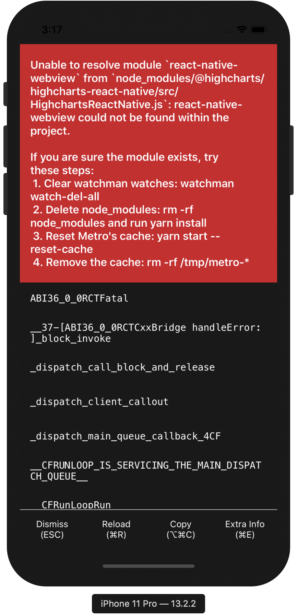

steps to create repo:

```sh
expo init highcharts-example --npm
cd highcharts-example
npm i @highcharts/highcharts-react-native
# copy basic usage example https://github.com/highcharts/highcharts-react-native#highcharts-chart
# from docs into Chart.js
npm start
```

`Unable to resolve "react-native-webview" from "node_modules/@highcharts/highcharts-react-native/src/HighchartsReactNative.js" Failed building JavaScript bundle.`



still broken after running:

```sh
watchman watch-del-all && \
  rm -rf node_modules/ && \
  npm cache clean --force && \
  rm -rf $TMPDIR/react-* && \
  rm -rf $TMPDIR/haste-* && \
  rm -rf $TMPDIR/metro-* && \
  npm install && \
  npm start -- -c
```
